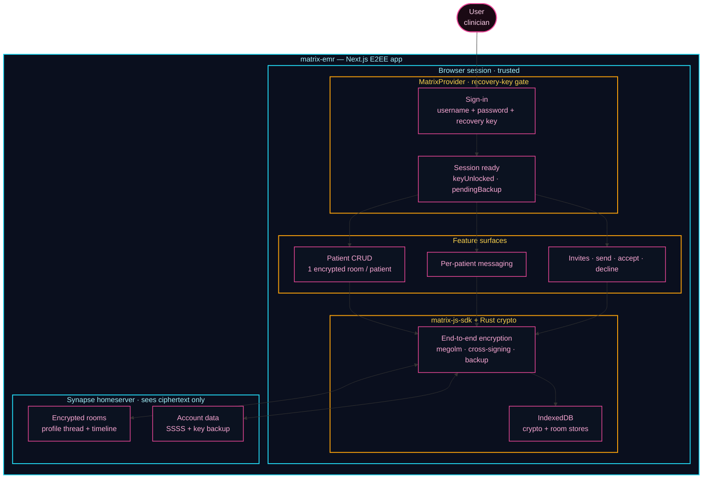
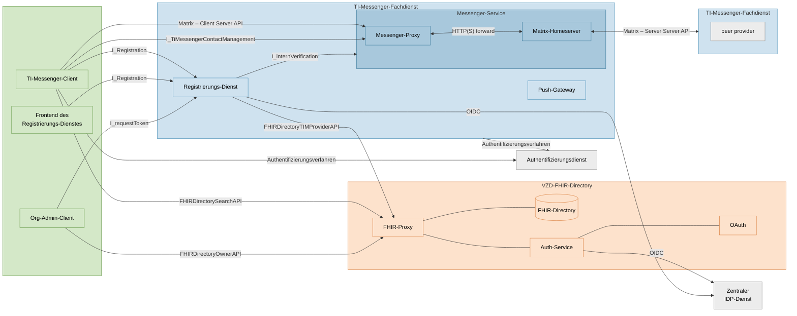

# Matrix Patient Records

End-to-end encrypted patient records built on top of Matrix. Each patient is a
private encrypted room; profile data lives in an `m.thread`, messages live in
the room timeline.

## Architecture



See `docs/v1.md` for per-flow sequence diagrams.

## TI-Messenger reference architecture

For comparison, this is gematik's TI-Messenger system overview — the German
healthcare Matrix federation this project could one day plug into.



Source: [gematik/api-ti-messenger](https://github.com/gematik/api-ti-messenger).

## Development

```bash
docker compose up -d   # local Synapse homeserver
pnpm install
pnpm dev
```

First session generates a recovery key (shown once). Subsequent sessions must
enter that key on sign-in — no feature is usable until the key is verified.
