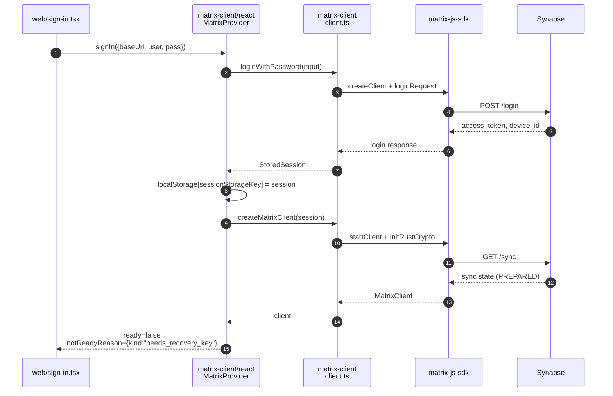
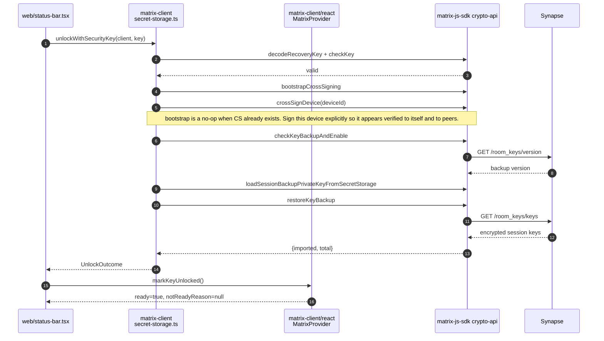
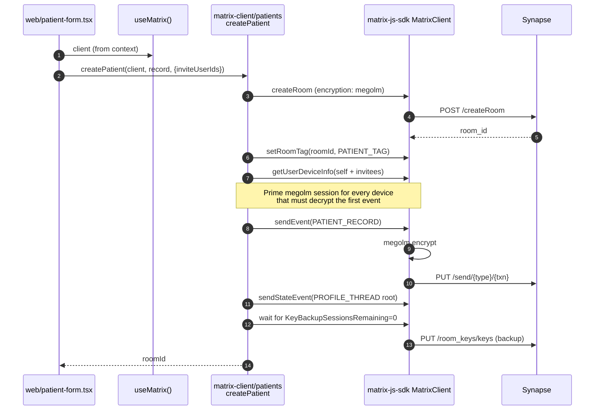
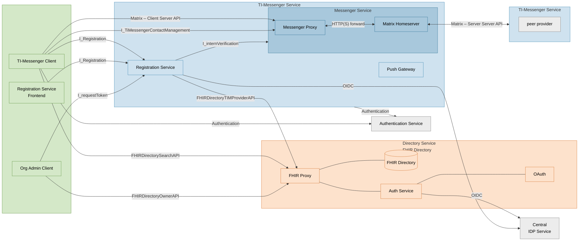

# Matrix Patient Records

End-to-end encrypted patient records built on top of Matrix. Each patient is a
private encrypted room; profile data lives in an `m.thread`, messages live in
the room timeline.

## Architecture

```mermaid
%%{init: {'theme':'base', 'themeVariables': {'background':'#ffffff','primaryTextColor':'#1f2937','lineColor':'#9ca3af','clusterBkg':'#ffffff','clusterBorder':'#ffffff'}}}%%

flowchart LR
    subgraph App["E2EE with matrix.org"]
        direction LR

        subgraph ClinicPOV["Practice software"]
            direction TB
            Clinic(["Clinic"]):::actor
        end

        subgraph PatientPOV["Patient app"]
            direction TB
            Patient(["Patient<br/>own account"]):::actor
        end

        subgraph BrowserZone["Browser session"]
            direction TB

            subgraph Gate["MatrixProvider"]
                direction TB
                SignIn["Sign-in<br/>username + password"]:::command
                RecoveryKey["Enter recovery key"]:::command
                Ready["Session ready"]:::event
                SignIn --> RecoveryKey
                RecoveryKey --> Ready
            end

            subgraph Sdk["matrix-js-sdk"]
                direction TB
                Crypto["End-to-end encryption"]:::policy
            end

            subgraph ClinicFeatures["Clinic features"]
                direction TB
                PatientCRUD["Patient CRUD<br/>Create/Update encrypted rooms"]:::command
                ClinicMsg["Message patient"]:::command
                SendInvite["Invite patient to room"]:::command
            end

            subgraph PatientFeatures["Patient features"]
                direction TB
                ViewHolders["Get connected clinics"]:::command
                ReadMsg["Read clinic messages"]:::command
                RespondInvite["Accept/Decline invites"]:::command
            end
        end

        subgraph SynapseZone["Synapse homeserver"]
            direction TB
            Rooms["Encrypted rooms<br/>profile thread + timeline"]:::external_system
            Account["Account data<br/>SSSS + key backup"]:::external_system
        end
    end

    Clinic --> SignIn
    Patient --> SignIn
    Ready --> PatientCRUD
    Ready --> ClinicMsg
    Ready --> SendInvite
    Ready --> ViewHolders
    Ready --> ReadMsg
    Ready --> RespondInvite
    PatientCRUD --> Crypto
    ClinicMsg --> Crypto
    SendInvite --> Crypto
    ViewHolders --> Crypto
    ReadMsg --> Crypto
    RespondInvite --> Crypto
    Crypto <--> Rooms
    Crypto <--> Account

    classDef actor fill:#ffffff,stroke:#166534,stroke-width:2px,color:#1f2937
    classDef command fill:#ffffff,stroke:#a7c5fc,stroke-width:2px,color:#1f2937
    classDef event fill:#ffffff,stroke:#feae57,stroke-width:2px,color:#1f2937
    classDef policy fill:#ffffff,stroke:#7c3aed,stroke-width:2px,color:#1f2937
    classDef reaction_policy fill:#ffffff,stroke:#da99e6,stroke-width:2px,color:#1f2937
    classDef read_model fill:#ffffff,stroke:#b0deb3,stroke-width:2px,color:#1f2937
    classDef ui fill:#ffffff,stroke:#f5f6f8,stroke-width:2px,color:#1f2937
    classDef external_system fill:#ffffff,stroke:#ffb3c5,stroke-width:2px,color:#1f2937

    style ClinicPOV fill:#ffffff,stroke:#ffffff,stroke-width:0px,color:#6b21a8
    style PatientPOV fill:#ffffff,stroke:#ffffff,stroke-width:0px,color:#6b21a8
    style App fill:#ffffff,stroke:#22d3ee,stroke-width:2px,color:#155e75
    style BrowserZone fill:#ffffff,stroke:#22d3ee,stroke-width:2px,color:#155e75
    style SynapseZone fill:#ffffff,stroke:#22d3ee,stroke-width:2px,color:#155e75
    style Gate fill:#ffffff,stroke:#000000,stroke-width:2px,color:#000000
    style Sdk fill:#ffffff,stroke:#000000,stroke-width:2px,color:#000000
    style ClinicFeatures fill:#ffffff,stroke:#000000,stroke-width:2px,color:#000000
    style PatientFeatures fill:#ffffff,stroke:#000000,stroke-width:2px,color:#000000
```

### Sign in and session bootstrap

### Unlock recovery key (the access gate)

### Create patient (mutation with E2EE)

## TI-Messenger reference architecture

Source: [gematik/api-ti-messenger](https://github.com/gematik/api-ti-messenger).

Same diagram with the German labels translated, for readers unfamiliar with the gematik terminology.

