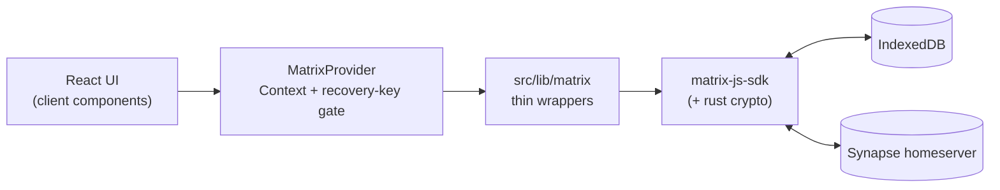
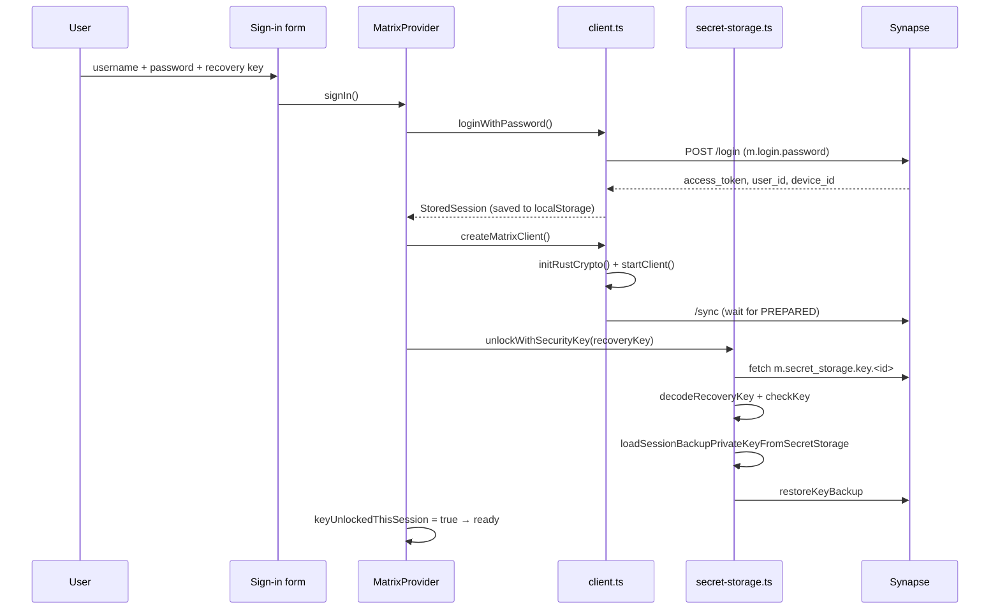
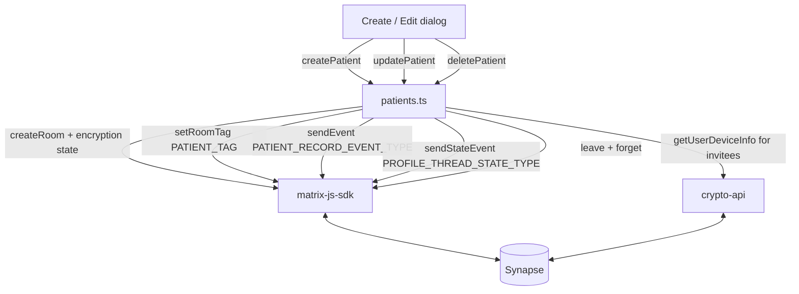
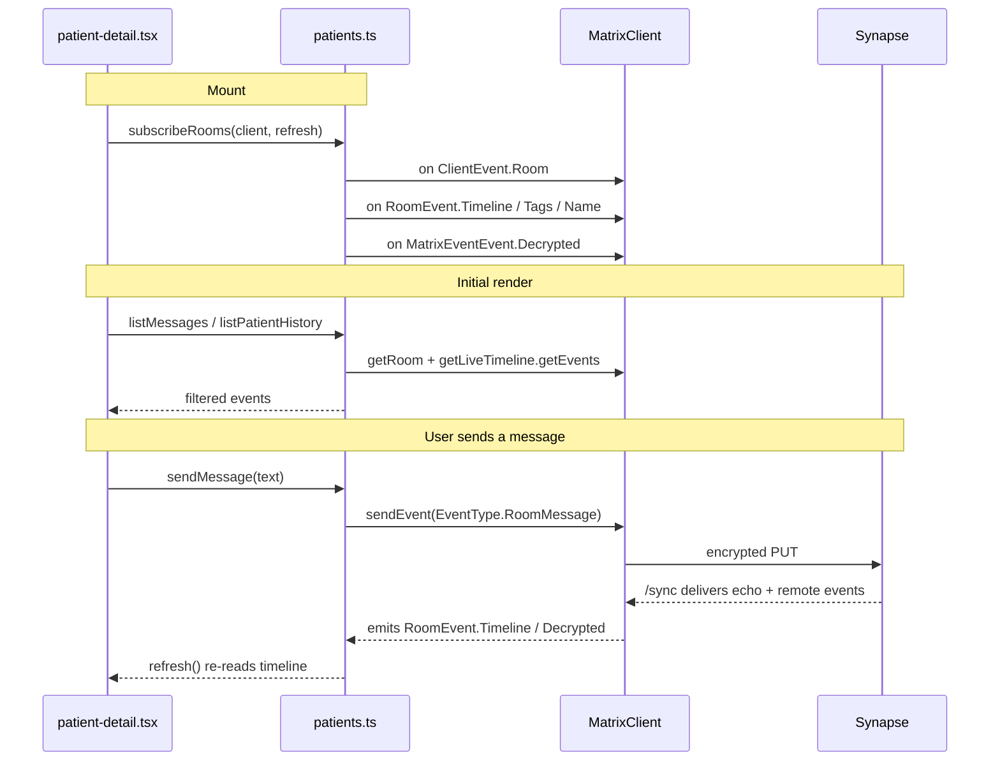
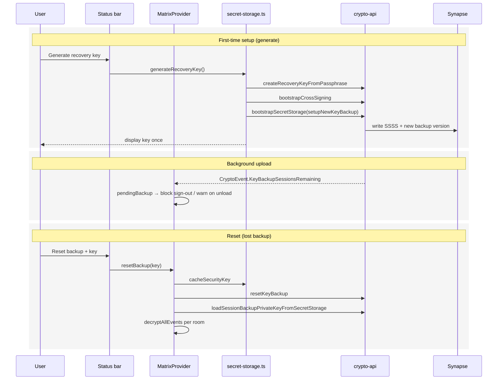
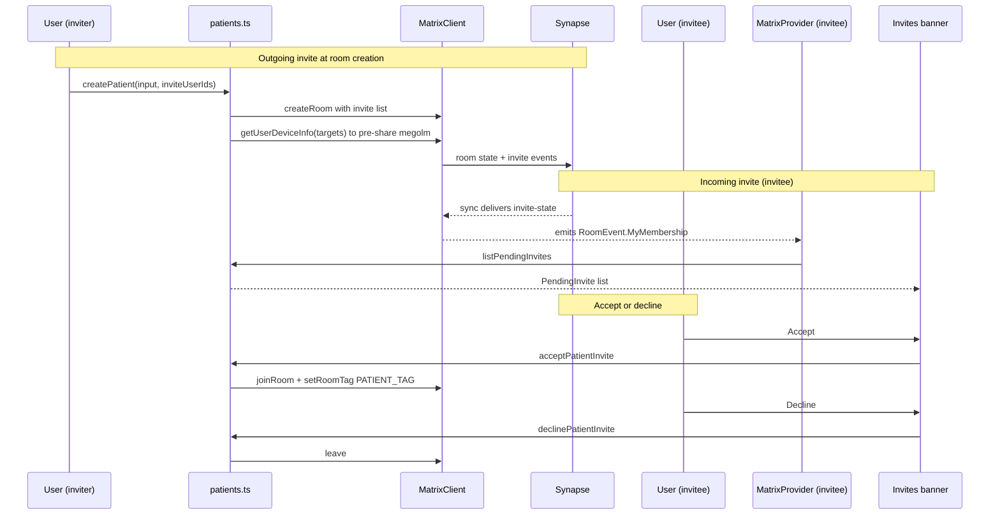
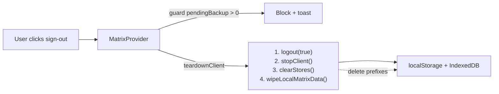

# Matrix Patient Records

E2EE patient records on top of Matrix. Each patient is a private encrypted
room; the profile is the root event of an `m.thread`, and revisions are
replies to that root. Messages live in the same room's main timeline.

## Architecture

The app has five independent flows. The diagrams below cover each one in
isolation; together they make up the whole.

### 1. Layers at a glance



### 2. Sign-in & unlock



### 3. Patient CRUD (encrypted room per patient)



Profile is the root of an `m.thread`; edits are replies that point at it
via `m.relates_to`. Latest reply wins when rendering.

### 4. Messaging & live updates



### 5. Recovery key & key backup



### 6. Invites



### 7. Sign-out & wipe



Wiped prefixes: IndexedDB `matrix-app:`, `matrix-app-crypto:`,
`matrix-js-sdk:`, `@matrix-org/`; localStorage `mx_`, `matrix-app.`,
`matrix-js-sdk`.

## Development

```bash
docker compose up -d   # local Synapse homeserver
pnpm install
pnpm dev
```

Sign in with a Matrix account on the local homeserver. The first session
must generate a recovery key (shown once); subsequent sessions need that
key to unlock — per the rule in `AGENTS.md`, no feature is usable until
the recovery key is entered.
