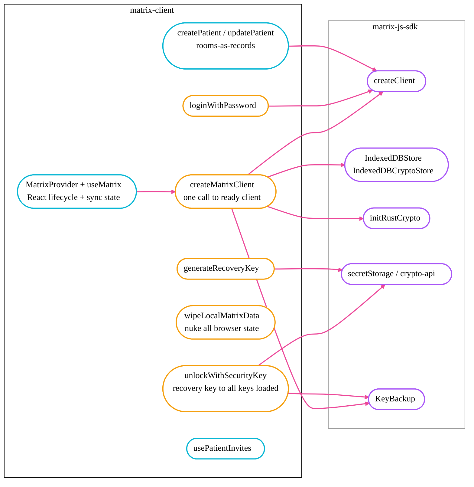
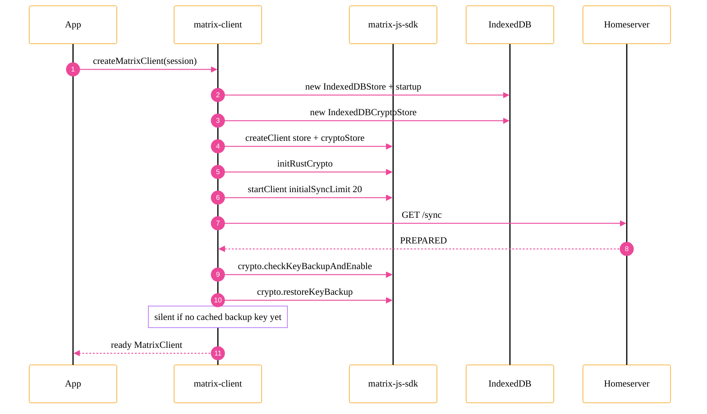
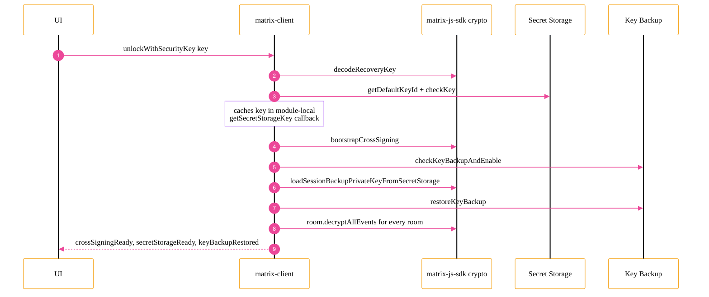
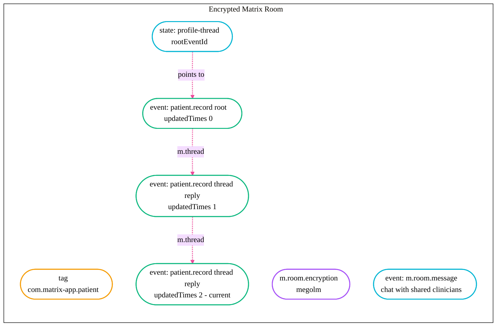
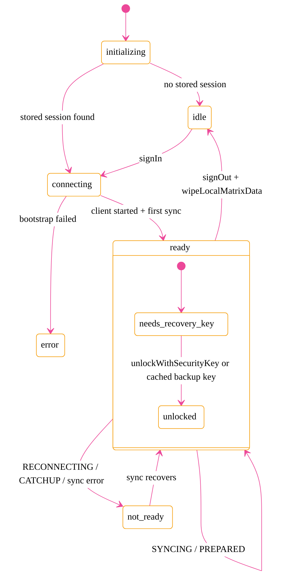

# matrix-client

An opinionated wrapper around [`matrix-js-sdk`](https://github.com/matrix-org/matrix-js-sdk) for building **E2EE-by-default** apps that store domain records as Matrix rooms.

This package is **not** a fork or replacement for `matrix-js-sdk`. It sits on top of it and bakes in the boilerplate you'd otherwise rewrite in every app: client bootstrap, Rust crypto init, secret-storage unlock, key-backup wiring, session persistence, and a small "rooms-as-records" pattern (here: patients).

```
┌──────────────────────────────┐
│      your Next.js app        │
└──────────────┬───────────────┘
               │  useMatrix(), createPatient(), …
┌──────────────▼───────────────┐
│   matrix-client (this pkg)   │   ← opinionated, ~1.2k LOC
└──────────────┬───────────────┘
               │  createClient, crypto API, secret storage
┌──────────────▼───────────────┐
│        matrix-js-sdk         │   ← protocol-level primitives
└──────────────────────────────┘
```

## Why does this exist?

Bare `matrix-js-sdk` gives you primitives. Shipping an E2EE product with it means making the same dozen decisions in every app — which crypto stack, where to store sessions, how to surface sync state, when to call `restoreKeyBackup`, etc. This package makes those decisions once.

### What this package adds on top of `matrix-js-sdk`



## Bootstrap: how much code disappears

The `createMatrixClient(session)` call replaces ~50 lines of setup. Here's the sequence:



In raw `matrix-js-sdk` you'd write each of those steps yourself, including the "wait until the first sync reaches `PREPARED`" dance and the silent restore-on-best-effort.

## Recovery-key unlock: one call, six SDK calls

Matrix's secret-storage flow is famously many-step. `unlockWithSecurityKey(client, recoveryKey)` collapses it:



Without this wrapper, forgetting just the `loadSessionBackupPrivateKeyFromSecretStorage()` step leaves the device with an active backup it cannot read — every old event surfaces as `HISTORICAL_MESSAGE_BACKUP_UNCONFIGURED`.

## Rooms-as-records pattern (patients)

Each patient is a **dedicated encrypted Matrix room**. The latest profile is the most recent custom event in the timeline; older revisions live as thread replies.



| Concern              | Where it lives                                                 |
| -------------------- | -------------------------------------------------------------- |
| Patient identity     | `roomId`                                                       |
| Current profile      | Latest `com.matrix-app.patient.record` event in the timeline   |
| History              | Thread of `patient.record` events, oldest = root               |
| Sharing              | Standard Matrix room invites — server never sees patient data  |
| Chat about a patient | Standard `m.room.message` events in the same room              |

API: `createPatient`, `updatePatient`, `listPatients`, `getPatient`, `listPatientHistory`, `deletePatient`, `listMessages`, `sendMessage`, plus invite helpers.

## React lifecycle (`MatrixProvider`)

The provider wraps the client in a state machine that gates feature access on **sync ready + recovery key entered**.



`useMatrix()` exposes `{ client, ready, notReadyReason, signIn, signOut, resetBackup, … }`. Consumers gate UI on `ready`; `notReadyReason` tells them *why* it isn't ready so they can render the right banner (sync spinner vs. recovery-key prompt).

## Quick comparison

| Task                                  | `matrix-js-sdk` alone                                       | `matrix-client`                             |
| ------------------------------------- | ----------------------------------------------------------- | ------------------------------------------- |
| Sign in + start client                | ~50 lines (stores, crypto, sync wait, backup enable)        | `await createMatrixClient(session)`         |
| Persist session in browser            | DIY                                                         | Built into `MatrixProvider`                 |
| Enter recovery key & restore history  | 6 SDK calls in the right order                              | `await unlockWithSecurityKey(client, key)`  |
| First-time recovery-key setup         | `bootstrapCrossSigning` + `bootstrapSecretStorage` + cache  | `await generateRecoveryKey(client)`         |
| Surface sync state to UI              | Listen to `ClientEvent.Sync`, debounce, etc.                | `useMatrix().syncState` / `ready`           |
| Sign out + scrub all local crypto     | `logout` + `clearStores` + sweep IndexedDB + localStorage   | `signOut()` (runs `wipeLocalMatrixData`)    |
| Wait for outbound key backup to drain | Listen to `CryptoEvent.KeyBackupSessionsRemaining`          | `pendingBackup` exposed; auto-awaited on writes |
| Store a versioned domain record       | DIY event types + thread plumbing                           | `createPatient` / `updatePatient`           |

## Install & usage

This package is currently consumed inside this monorepo only — see `web/` for live usage.

```tsx
import { MatrixProvider, useMatrix } from "matrix-client/react";
import { listPatients, createPatient } from "matrix-client/patients";

function App({ children }) {
  return <MatrixProvider>{children}</MatrixProvider>;
}

function PatientList() {
  const { client, ready } = useMatrix();
  if (!ready || !client) return null;
  const patients = listPatients(client);
  return <ul>{patients.map(p => <li key={p.roomId}>{p.record.firstName}</li>)}</ul>;
}
```

## Module layout

| File                  | Exports                                                                  |
| --------------------- | ------------------------------------------------------------------------ |
| `src/client.ts`       | `createMatrixClient`, `loginWithPassword`                                |
| `src/secret-storage.ts` | `generateRecoveryKey`, `unlockWithSecurityKey`, `getStatus`, cache helpers |
| `src/wipe.ts`         | `wipeLocalMatrixData`                                                    |
| `src/patients.ts`     | `createPatient`, `updatePatient`, `listPatients`, `listPatientHistory`, invite + message helpers |
| `src/react/provider.tsx` | `MatrixProvider`, `useMatrix`                                         |
| `src/react/invites.ts`   | `usePatientInvites`                                                    |
| `src/types.ts`        | `StoredSession`, default URLs                                            |
